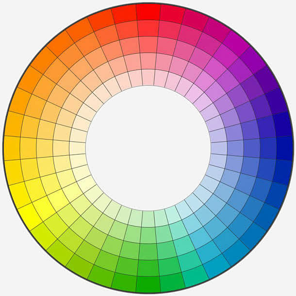
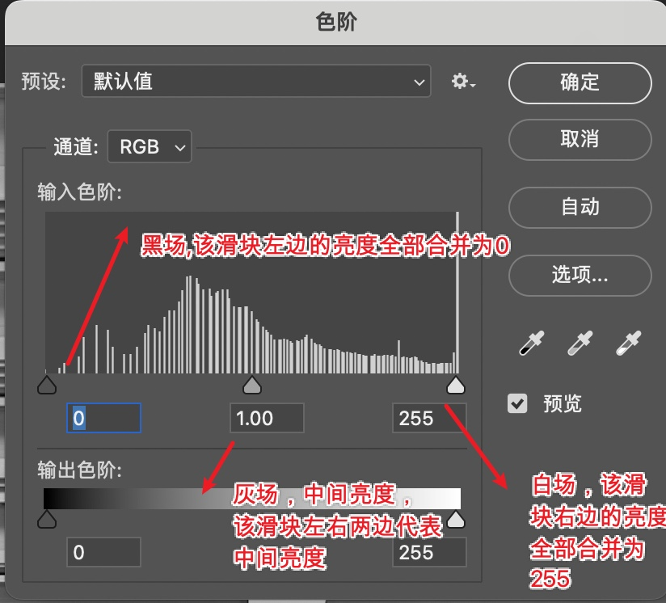

# 色彩理论

### 色彩基础理论

> **原色通道**
>
> 1. 一般情况下，我们使用8位通道，即2的8次方=256种色阶
> 2. 单个原色通道0~255个发光等级
> 3. 0 = 黑色 = 不发光
> 4. 1 ~ 254 = 灰阶 = 不同等级的发光强度
> 5. 255 = 白色 = 最高强度的色光
>
> **色彩三要素**
>
> * 色相  【颜色的品相，在色相环上的角度】
> * 饱和度  【颜色的鲜艳程度，加入灰白的多少】
> * 明度   【光线的强度】
>
> 
>
> 色相环上相差15度叫同类色，相差45度叫邻近色，相差120度叫对比色，相差180度叫补色
>
> 亮度：亮度指照射在景物或图像上光线的明暗程度。图像亮度增加时，就会显得耀眼或刺眼，亮度越小时，图像就会显得灰暗。
>
> 对比度：对比度指不同颜色之间的差别。对比度越大，不同颜色之间的反差越大，即所谓黑白分明，对比度过大，图像就会显得很刺眼。对比度越小，不同颜色之间的反差就越小。对比度越大，亮的地方越亮，暗的地方越暗。
>
> 色阶：
>
> 
>
> 中间的图像叫直方图，x轴代表亮度，y轴代表处于这个亮度的像素数量，中间的滑块是调整黑场和白场的比例的
>
> 输出色阶：是对图像的整体亮度做一个限制，整个图像的亮度不能高于输出色阶的最大值，也不能低于输出色阶的最小值